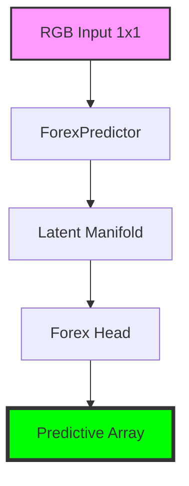

# LemGendary Forex Predictor (Multi-Scale CNN-Transformer)

   

## Overview

The **LemGendary Forex Predictor (Multi-Scale CNN-Transformer)** is a professional-grade AI model optimized for the `forex` lifecycle within the LemGendary Training Suite.

- **Architecture**: ForexPredictor (Multi-Scale CNN-Transformer (Causal TCN + Cross-Timeframe Attention))
- **Input Resolution**: 1x1
- **Use Case**: Multi-pair, multi-timeframe Forex trading model trained on MetaTrader 5 OHLCV data. Predicts trade direction (Up/Down/Sideways) and magnitude (TP/SL pips) for all major currency pairs. Architecture uses causal Conv1D stacks per timeframe fused via cross-timeframe attention. Fully stateless and ONNX-compatible for live MT5 EA deployment.

- **Training Data**: LemGendizedForexPredictorLarge

## Manifold Topology



## Usage

```python
# Premium CLI Integration provided for generative/VLM tasks.
```

> [!TIP]
> **Implementation Guide**: For high-performance deployment including ONNX (FP32/FP16) and standalone PyTorch snippets, refer to the **[forex_predictor_usage.ipynb](forex_predictor_usage.ipynb)** notebook in this directory.

- **Input Requirements**: RGB Image Tensors normalized to ImageNet stats.
- **Failures**: Large aspect ratio distortions during standard resize phases.

## Implementation Requirements

- **Hardware**: NVIDIA GeForce GTX 1650 (4G VRAM)
- **Software**: PyTorch 2.1+, CUDA 12.1.
- **Training Lifecycle**: Successfully processed over 4 total epochs securely.

## Model Stats

- **Precision**: ONNX FP16 (Edge) / PyTorch FP32 (Training).
- **Latency**: Sub-50ms inference bound on target local GPU hardware.
- **Stability**: Trained using **FOREX_DUAL Loss** to enforce strict manifold alignment.

## Data Manifest

- **LemGendizedForexPredictorLarge**: ~N/A binary image samples.

## Evaluation Results

- **Baseline Achievement**: **PSNR**: 0.0 | **SSIM**: 0.0 | **LPIPS**: 0.0 | **FID**: 0.0
- **Split**: 80/20 train/validate with zero sample-leakage.

---
**LemGendary AI Training Suite** | *SOTA-Autonomous & Nuclear-Hardened Matrix*
