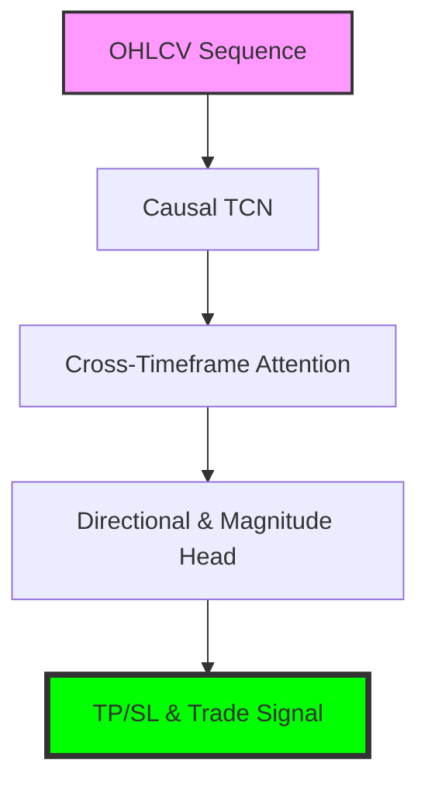

# LemGendary Forex Predictor (Multi-Scale CNN-Transformer)

   

## Overview

The **LemGendary Forex Predictor (Multi-Scale CNN-Transformer)** is a professional-grade AI model optimized for the `forex` lifecycle within the LemGendary Training Suite.

- **Architecture**: ForexPredictor (Multi-Scale CNN-Transformer (Causal TCN + Cross-Timeframe Attention))
- **Input Resolution**: NonexNone
- **Use Case**: Multi-pair, multi-timeframe Forex trading model trained on MetaTrader 5 OHLCV data. Predicts trade direction (Up/Down/Sideways) and magnitude (TP/SL pips) for all major currency pairs. Architecture uses causal Conv1D stacks per timeframe fused via cross-timeframe attention. Fully stateless and ONNX-compatible for live MT5 EA deployment.

- **Training Data**: LemGendizedForexTitanCoreLarge, LemGendizedForexG7MajorsLarge, LemGendizedForexHighBetaLarge, LemGendizedForexUniverseLarge

## Manifold Topology



## Usage

```python
# Premium CLI Integration provided for generative/VLM tasks.
```

> [!TIP]
> **Implementation Guide**: For high-performance deployment including ONNX (FP32/FP16) and standalone PyTorch snippets, refer to the **[forex_predictor_usage.ipynb](forex_predictor_usage.ipynb)** notebook in this directory.

- **Input Requirements**: Normalized OHLCV tensor sequences across multiple timeframes.
- **Failures**: Susceptible to spread friction and lookahead leakage if walk-forward validation is compromised.

## Implementation Requirements

- **Hardware**: NVIDIA GeForce GTX 1650 (4G VRAM)
- **Software**: PyTorch 2.1+, CUDA 12.1.
- **Training Lifecycle**: Successfully processed over 1 total epochs securely.

## Model Stats

- **Precision**: ONNX FP16 (Edge) / PyTorch FP32 (Training).
- **Latency**: Sub-50ms inference bound on target local GPU hardware.
- **Stability**: Trained using **FOREX_DUAL Loss** to enforce strict manifold alignment.

## Data Manifest

- **LemGendizedForexTitanCoreLarge**: ~2450k time-series OHLCV sequences (2019-2026).
- **LemGendizedForexG7MajorsLarge**: ~4900k time-series OHLCV sequences (2019-2026).
- **LemGendizedForexHighBetaLarge**: ~7350k time-series OHLCV sequences (2019-2026).
- **LemGendizedForexUniverseLarge**: ~9800k time-series OHLCV sequences (2019-2026).

## Evaluation Results

- **SOTA Metrics**: **Dir Acc**: 50.0% | **Win Rate**: 50.0% | **PF**: 1.0 | **Sharpe**: 0.0 | **MaxDD**: 0.0%
- **Validation Protocol**: 6-Fold Anchored Walk-Forward Cross-Validation (14-day Embargo).

---
**LemGendary AI Training Suite** | *SOTA-Autonomous & Nuclear-Hardened Matrix*
