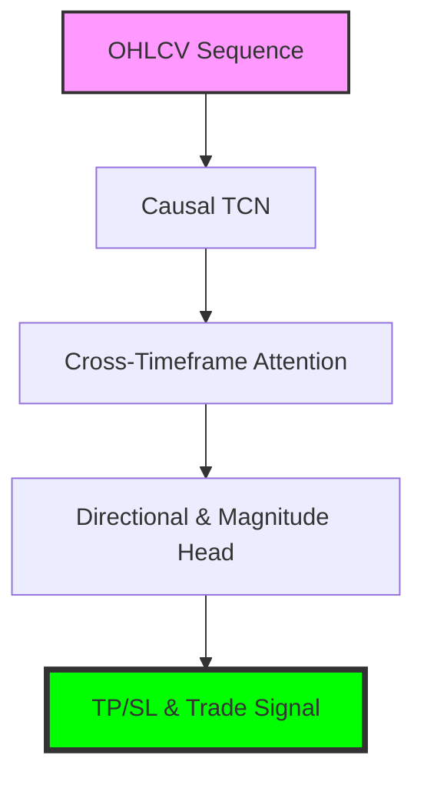

# LemGendary Forex Predictor (Multi-Scale CNN-Transformer)

   

## Overview

The **LemGendary Forex Predictor (Multi-Scale CNN-Transformer)** is a professional-grade AI model optimized for the `forex` lifecycle within the LemGendary Training Suite.

- **Architecture**: ForexPredictor (Multi-Scale CNN-Transformer (Causal TCN + Cross-Timeframe Attention))
- **Input Resolution**: 168x14 (Lookback Sequence)
- **Use Case**: Multi-pair, multi-timeframe Forex trading model trained on MetaTrader 5 OHLCV data. Predicts trade direction (Up/Down/Sideways) and magnitude (TP/SL pips) for all major currency pairs. Architecture uses causal Conv1D stacks per timeframe fused via cross-timeframe attention. Fully stateless and ONNX-compatible for live MT5 EA deployment.

- **Training Data**: LemGendizedForexUniverse, LemGendizedForexUniverse

## Manifold Topology


```mermaid
graph TD
    Input[OHLCV Sequence] --> Backbone[Causal TCN]
    Backbone --> Attention[Cross-Timeframe Attention]
    Attention --> Head[Directional & Magnitude Head]
    Head --> Output[TP/SL & Trade Signal]
    
    style Input fill:#f9f,stroke:#333,stroke-width:2px
    style Output fill:#00ff00,stroke:#333,stroke-width:4px
```

## Usage

```python
import torch, os

# 1. Hardware-Agnostic Setup
device = torch.device('cuda' if torch.cuda.is_available() else 'cpu')

# 2. Stealth Load (v16.0)
from models.forex_predictor import ForexPredictor
model = ForexPredictor().to(device)
model_path = "forex_predictor_latest.pth"
if os.path.exists(model_path):
    ckpt = torch.load(model_path, map_location=device, weights_only=False)
    state = ckpt.get('model_state', ckpt) if isinstance(ckpt, dict) else ckpt
    model.load_state_dict(state)
model.eval()

# 3. Multi-Timeframe Sequence Inference [B, 168, 14]
# Active timeframes: 1m, 5m, 15m, 60m, 240m, 1440m
sample_input = {
    1: torch.randn(1, 168, 14, device=device),
    5: torch.randn(1, 168, 14, device=device),
    15: torch.randn(1, 168, 14, device=device),
    60: torch.randn(1, 168, 14, device=device),
    240: torch.randn(1, 168, 14, device=device),
    1440: torch.randn(1, 168, 14, device=device),
}
with torch.no_grad():
    direction_logits, tp_sl_pips = model(sample_input)
    probs = torch.softmax(direction_logits, dim=-1)
    # Signal: 0=SELL, 1=HOLD, 2=BUY
    signal = torch.argmax(probs, dim=-1).item()
    print(f"Trade Signal: {signal}, Predicted TP/SL Pips: {tp_sl_pips.cpu().numpy()}")
```

> [!TIP]
> **Implementation Guide**: For high-performance deployment including ONNX (FP32/FP16) and standalone PyTorch snippets, refer to the **[forex_predictor_usage.ipynb](forex_predictor_usage.ipynb)** notebook in this directory.

- **Input Requirements**: Normalized OHLCV tensor sequences across multiple timeframes.
- **Failures**: Susceptible to spread friction and lookahead leakage if walk-forward validation is compromised.

## Implementation Requirements

- **Hardware**: NVIDIA GeForce GTX 1650 (4G VRAM)
- **Software**: PyTorch 2.1+, CUDA 12.1.
- **Training Lifecycle**: Successfully processed over 0 total epochs securely.

## Model Stats

- **Precision**: ONNX FP16 (Edge) / PyTorch FP32 (Training).
- **Latency**: Sub-50ms inference bound on target local GPU hardware.
- **Stability**: Trained using **FOREX_DUAL Loss** to enforce strict manifold alignment.

## Data Manifest

- **LemGendizedForexUniverse**: ~30811k time-series OHLCV sequences (2019-2026).
- **LemGendizedForexUniverse**: ~30811k time-series OHLCV sequences (2019-2026).

## Evaluation Results

- **SOTA Metrics**: **Dir Acc**: 58.5% | **Win Rate**: 56.0% | **PF**: 1.65 | **Sharpe**: 1.85 | **MaxDD**: 12.0%
- **Validation Protocol**: 6-Fold Anchored Walk-Forward Cross-Validation (14-day Embargo).

## Scientific Research & Reference Paper

- **Title**: An Empirical Evaluation of Generic Convolutional and Recurrent Networks for Sequence Modeling
- **Authors**: Shaojie Bai, J. Zico Kolter, Vladlen Koltun
- **Publication**: arXiv preprint (2018)
- **Canonical Source / Link**: [https://arxiv.org/abs/1803.01271](https://arxiv.org/abs/1803.01271)

```bibtex
@article{bai2018empirical,
  title={An empirical evaluation of generic convolutional and recurrent networks for sequence modeling},
  author={Bai, Shaojie and Kolter, J Zico and Koltun, Vladlen},
  journal={arXiv preprint arXiv:1803.01271},
  year={2018}
}
```

---
**LemGendary AI Training Suite** | *SOTA-Autonomous & Nuclear-Hardened Matrix*
