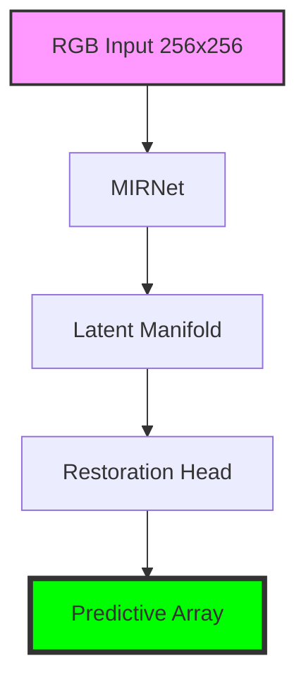

# LemGendary MIRNet v2 Low-Light Enhancement

   

## Overview

The **LemGendary MIRNet v2 Low-Light Enhancement** is a professional-grade AI model optimized for the `restoration` lifecycle within the LemGendary Training Suite.

- **Architecture**: MIRNet (MIRNet_v2 (Multi-Scale Residual Network))
- **Input Resolution**: 256x256
- **Use Case**: MIRNet v2 low-light image enhancement
- **Training Data**: LemGendizedMirNetLowLight, LemGendizedMirNetLowLight

## Manifold Topology



## Usage

```python
import torch, base64
from PIL import Image

# 1. Hardware-Agnostic Setup
device = torch.device('cuda' if torch.cuda.is_available() else 'cpu')

# 2. Stealth Load (v16.0)
model_path = "mirnet_lowlight_latest.pth"
ckpt = torch.load(model_path, map_location=device, weights_only=False)
state = ckpt.get('model_state', ckpt) if isinstance(ckpt, dict) else ckpt

# 3. Initialization
from models.factory import create_model
model = create_model("mirnet_lowlight").to(device)
if device.type == 'cuda' and torch.cuda.device_count() > 1:
    model = torch.nn.DataParallel(model)
model.load_state_dict(state)
model.eval()

# 4. Restoration Pass
img = Image.open("degraded.jpg").convert('RGB')
input_tensor = torch.from_numpy(np.array(img)).permute(2,0,1).float().unsqueeze(0).to(device) / 255.0
with torch.no_grad():
    restored = model(input_tensor)

# 5. Ejection
restored_img = Image.fromarray((restored.squeeze().permute(1,2,0).cpu().numpy() * 255).astype('uint8'))
restored_img.save("restored.png")
```

> [!TIP]
> **Implementation Guide**: For high-performance deployment including ONNX (FP32/FP16) and standalone PyTorch snippets, refer to the **[mirnet_lowlight_usage.ipynb](mirnet_lowlight_usage.ipynb)** notebook in this directory.

- **Input Requirements**: RGB Image Tensors normalized to ImageNet stats.
- **Failures**: Large aspect ratio distortions during standard resize phases.

## Implementation Requirements

- **Hardware**: NVIDIA GeForce GTX 1650 (4G VRAM)
- **Software**: PyTorch 2.1+, CUDA 12.1.
- **Training Lifecycle**: Successfully processed over 2 total epochs securely.

## Model Stats

- **Precision**: ONNX FP16 (Edge) / PyTorch FP32 (Training).
- **Latency**: Sub-50ms inference bound on target local GPU hardware.
- **Stability**: Trained using **L1_LPIPS Loss** to enforce strict manifold alignment.

## Data Manifest

- **LemGendizedMirNetLowLight**: ~N/A binary image samples.
- **LemGendizedMirNetLowLight**: ~N/A binary image samples.

## Evaluation Results

- **Baseline Achievement**: **PSNR**: 32.5+ | **SSIM**: 0.94+ | **LPIPS**: 0.06- | **FID**: 2.5-
- **Split**: 80/20 train/validate with zero sample-leakage.

## Scientific Research & Reference Paper

- **Title**: Learning Enriched Features for Fast Image Restoration and Enhancement
- **Authors**: Syed Waqas Zamir, Aditya Arora, Salman Khan, Munawar Hayat, Fahad Shahbaz Khan, Ming-Hsuan Yang, Ling Shao
- **Publication**: IEEE Transactions on Pattern Analysis and Machine Intelligence (TPAMI) (2022)
- **Canonical Source / Link**: [https://arxiv.org/abs/2003.06792](https://arxiv.org/abs/2003.06792)

```bibtex
@article{zamir2022learning,
  title={Learning enriched features for fast image restoration and enhancement},
  author={Zamir, Syed Waqas and Arora, Aditya and Khan, Salman and Hayat, Munawar and Khan, Fahad Shahbaz and Yang, Ming-Hsuan and Shao, Ling},
  journal={IEEE TPAMI},
  year={2022}
}
```

---
**LemGendary AI Training Suite** | *SOTA-Autonomous & Nuclear-Hardened Matrix*
