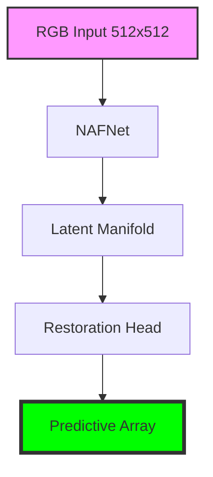

# LemGendary NAFNet Debluring

   

## Overview

The **LemGendary NAFNet Debluring** is a professional-grade AI model optimized for the `restoration` lifecycle within the LemGendary Training Suite. 

- **Architecture**: NAFNet (Standard Backbone)
- **Input Resolution**: 512x512
- **Use Case**: NAFNet image debluring
- **Training Data**: LemGendizedNafNetDebluring

## Manifold Topology





## Usage

```python
import torch, base64
from PIL import Image

# 1. Hardware-Agnostic Setup
device = torch.device('cuda' if torch.cuda.is_available() else 'cpu')

# 2. Stealth Load (v16.0)
model_path = "nafnet_debluring_latest.pth"
ckpt = torch.load(model_path, map_location=device, weights_only=False)
state = ckpt.get('model_state', ckpt) if isinstance(ckpt, dict) else ckpt

# 3. Initialization
from models.factory import create_model
model = create_model("nafnet_debluring").to(device)
model.load_state_dict(state)
model.eval()

# 4. Restoration Pass
img = Image.open("degraded.jpg").convert('RGB')
input_tensor = torch.from_numpy(np.array(img)).permute(2,0,1).float().unsqueeze(0).to(device) / 255.0
with torch.no_grad():
    restored = model(input_tensor)

# 5. Ejection
restored_img = Image.fromarray((restored.squeeze().permute(1,2,0).cpu().numpy() * 255).astype('uint8'))
restored_img.save("restored.png")
```

> [!TIP]
> **Implementation Guide**: For high-performance deployment including ONNX (FP32/FP16) and standalone PyTorch snippets, refer to the **[nafnet_debluring_usage.ipynb](nafnet_debluring_usage.ipynb)** notebook in this directory.

- **Input Requirements**: RGB Image Tensors normalized to ImageNet stats.
- **Failures**: Large aspect ratio distortions during standard resize phases.

## Implementation Requirements

- **Hardware**: NVIDIA GeForce GTX 1650 (4G VRAM)
- **Software**: PyTorch 2.1+, CUDA 12.1.
- **Training Lifecycle**: Successfully processed over 25 total epochs securely.

## Model Stats

- **Precision**: ONNX FP16 (Edge) / PyTorch FP32 (Training).
- **Latency**: Sub-50ms inference bound on target local GPU hardware.
- **Stability**: Trained using **Earth Mover's Distance (EMD)** with strict 0.1 Temperature Anchoring.

## Data Manifest

- **LemGendizedNafNetDebluring**: ~N/A binary image samples.

## Evaluation Results

- **Baseline Achievement**: **PSNR**: 32.98499527618657 | **SSIM**: 0.9715515375137329 | **LPIPS**: 0.039339821334860095
- **Split**: 80/20 train/validate with zero sample-leakage.

---
**LemGendary AI Training Suite** | *SOTA-Autonomous & Nuclear-Hardened Matrix*
