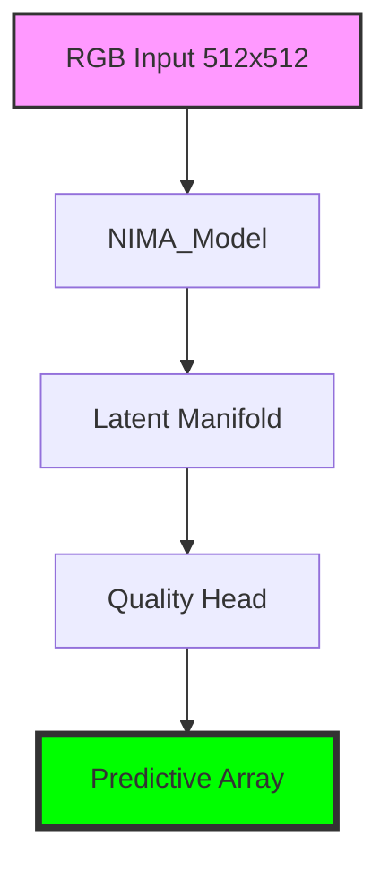

# LemGendary NIMA Aesthetic Scorer (Mobile)

   

## Overview

The **LemGendary NIMA Aesthetic Scorer (Mobile)** is a professional-grade AI model optimized for the `quality` lifecycle within the LemGendary Training Suite. 

- **Architecture**: NIMA_Model (MobileNetV2 (Global Composition))
- **Input Resolution**: 512x512
- **Use Case**: Aesthetic quality scorer trained on custom standardized LemGendizedQualityDataset, optimized for artistic composition and color harmony.
- **Training Data**: LemGendizedNimaAestheticMobile

## Manifold Topology





> [!IMPORTANT]
> **Quality Vector**: This model is specialized for **Aesthetics**. 
> - **Primary Targets**: Composition, Color, Lighting, Artistic Intent.


## Usage

```python
import torch, base64
from PIL import Image

# 1. Hardware-Agnostic Setup
device = torch.device('cuda' if torch.cuda.is_available() else 'cpu')

# 2. Stealth Load (v16.0)
model_path = "nima_aesthetic_mobile_latest.pth"
ckpt = torch.load(model_path, map_location=device, weights_only=False)
state = ckpt.get('model_state', ckpt) if isinstance(ckpt, dict) else ckpt

# 3. Initialization
from models.nima import NIMA_Model
model = NIMA_Model().to(device)
model.load_state_dict(state)
model.eval()

# 4. Forward Pass
img = Image.open("photo.jpg").convert('RGB').resize((512, 512))
input_tensor = torch.from_numpy(np.array(img)).permute(2,0,1).float().unsqueeze(0).to(device) / 255.0
with torch.no_grad():
    probs = model(input_tensor)

# 5. Score Calculation
scores = torch.arange(1, 11).float().to(device)
mean_score = torch.sum(probs * scores).item()
print(f"Quality Score: {mean_score:.2f}")
```

> [!TIP]
> **Implementation Guide**: For high-performance deployment including ONNX (FP32/FP16) and standalone PyTorch snippets, refer to the **[nima_aesthetic_mobile_usage.ipynb](nima_aesthetic_mobile_usage.ipynb)** notebook in this directory.

- **Input Requirements**: RGB Image Tensors normalized to ImageNet stats.
- **Failures**: Large aspect ratio distortions during standard resize phases.

## Implementation Requirements

- **Hardware**: NVIDIA GeForce GTX 1650 (4G VRAM)
- **Software**: PyTorch 2.1+, CUDA 12.1.
- **Training Lifecycle**: Successfully processed over 63 total epochs securely.

## Model Stats

- **Precision**: ONNX FP16 (Edge) / PyTorch FP32 (Training).
- **Latency**: Sub-50ms inference bound on target local GPU hardware.
- **Stability**: Trained using **Earth Mover's Distance (EMD)** with strict 0.1 Temperature Anchoring.

## Data Manifest

- **LemGendizedNimaAestheticMobile**: ~N/A binary image samples.

## Evaluation Results

- **Baseline Achievement**: **PLCC**: 0.47201135754585266 | **SRCC**: 0.48524864836735954
- **Split**: 80/20 train/validate with zero sample-leakage.

---
**LemGendary AI Training Suite** | *SOTA-Autonomous & Nuclear-Hardened Matrix*
