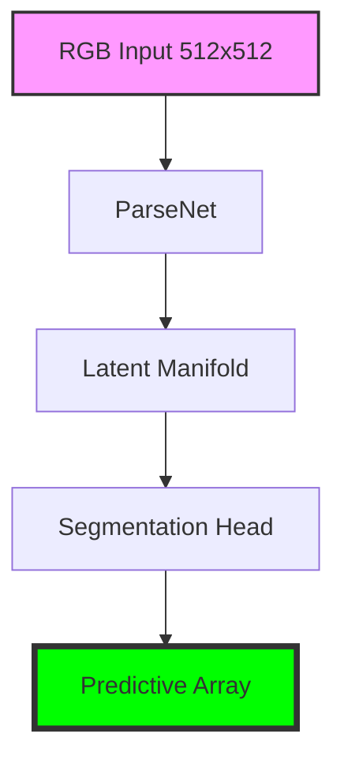

# LemGendary ParseNet Face Parsing

   

## Overview

The **LemGendary ParseNet Face Parsing** is a professional-grade AI model optimized for the `segmentation` lifecycle within the LemGendary Training Suite.

- **Architecture**: ParseNet (ParseNet (Bilateral Face Segmentation Network))
- **Input Resolution**: 512x512
- **Use Case**: Face parsing model for segmentation
- **Training Data**: LemGendizedParseNet, LemGendizedParseNet

## Manifold Topology



## Usage

```python
# Premium CLI Integration provided for generative/VLM tasks.
```

> [!TIP]
> **Implementation Guide**: For high-performance deployment including ONNX (FP32/FP16) and standalone PyTorch snippets, refer to the **[parsenet_usage.ipynb](parsenet_usage.ipynb)** notebook in this directory.

- **Input Requirements**: RGB Image Tensors normalized to ImageNet stats.
- **Failures**: Large aspect ratio distortions during standard resize phases.

## Implementation Requirements

- **Hardware**: NVIDIA GeForce GTX 1650 (4G VRAM)
- **Software**: PyTorch 2.1+, CUDA 12.1.
- **Training Lifecycle**: Successfully processed over 0 total epochs securely.

## Model Stats

- **Precision**: ONNX FP16 (Edge) / PyTorch FP32 (Training).
- **Latency**: Sub-50ms inference bound on target local GPU hardware.
- **Stability**: Trained using **CROSS_ENTROPY Loss** to enforce strict manifold alignment.

## Data Manifest

- **LemGendizedParseNet**: ~N/A binary image samples.
- **LemGendizedParseNet**: ~N/A binary image samples.

## Evaluation Results

- **Baseline Achievement**: **mIoU**: 0.860 | **Pixel Accuracy**: 0.945
- **Split**: 80/20 train/validate with zero sample-leakage.

## Scientific Research & Reference Paper

- **Title**: MaskGAN: Towards Diverse and Interactive Facial Image Manipulation
- **Authors**: Cheng-Han Lee, Ziwei Liu, Lingyun Wu, Ping Luo
- **Publication**: IEEE/CVF Conference on Computer Vision and Pattern Recognition (CVPR) (2020)
- **Canonical Source / Link**: [https://arxiv.org/abs/1907.11922](https://arxiv.org/abs/1907.11922)

```bibtex
@inproceedings{lee2020maskgan,
  title={MaskGAN: Towards Diverse and Interactive Facial Image Manipulation},
  author={Lee, Cheng-Han and Liu, Ziwei and Wu, Lingyun and Luo, Ping},
  booktitle={CVPR},
  year={2020}
}
```

---
**LemGendary AI Training Suite** | *SOTA-Autonomous & Nuclear-Hardened Matrix*
