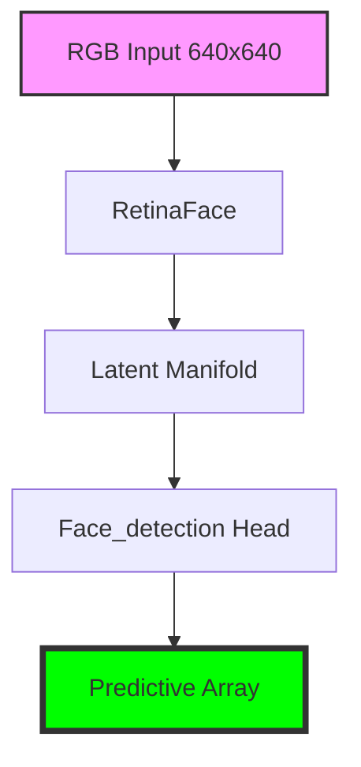

# LemGendary RetinaFace Detection

   

## Overview

The **LemGendary RetinaFace Detection** is a professional-grade AI model optimized for the `face_detection` lifecycle within the LemGendary Training Suite.

- **Architecture**: RetinaFace (RetinaFace (MobileNetV1-0.25 FPN Backbone))
- **Input Resolution**: 640x640
- **Use Case**: MobileNet-based face detection
- **Training Data**: LemGendizedRetinaFace, LemGendizedRetinaFace

## Manifold Topology



## Usage

```python
# Premium CLI Integration provided for generative/VLM tasks.
```

> [!TIP]
> **Implementation Guide**: For high-performance deployment including ONNX (FP32/FP16) and standalone PyTorch snippets, refer to the **[retinaface_usage.ipynb](retinaface_usage.ipynb)** notebook in this directory.

- **Input Requirements**: RGB Image Tensors normalized to ImageNet stats.
- **Failures**: Large aspect ratio distortions during standard resize phases.

## Implementation Requirements

- **Hardware**: NVIDIA GeForce GTX 1650 (4G VRAM)
- **Software**: PyTorch 2.1+, CUDA 12.1.
- **Training Lifecycle**: Successfully processed over 0 total epochs securely.

## Model Stats

- **Precision**: ONNX FP16 (Edge) / PyTorch FP32 (Training).
- **Latency**: Sub-50ms inference bound on target local GPU hardware.
- **Stability**: Trained using **RETINAFACE Loss** to enforce strict manifold alignment.

## Data Manifest

- **LemGendizedRetinaFace**: ~N/A binary image samples.
- **LemGendizedRetinaFace**: ~N/A binary image samples.

## Evaluation Results

- **Baseline Achievement**: **mAP (Easy)**: 0.915 | **mAP (Medium)**: 0.890 | **mAP (Hard)**: 0.750
- **Split**: 80/20 train/validate with zero sample-leakage.

## Scientific Research & Reference Paper

- **Title**: RetinaFace: Single-Shot Multi-Level Face Localisation in the Wild
- **Authors**: Jiankang Deng, Jia Guo, Evangelos Ververas, Irene Kotsia, Stefanos Zafeiriou
- **Publication**: IEEE/CVF Conference on Computer Vision and Pattern Recognition (CVPR) (2020)
- **Canonical Source / Link**: [https://arxiv.org/abs/1905.00641](https://arxiv.org/abs/1905.00641)

```bibtex
@inproceedings{deng2020retinaface,
  title={Retinaface: Single-shot multi-level face localisation in the wild},
  author={Deng, Jiankang and Guo, Jia and Ververas, Evangelos and Kotsia, Irene and Zafeiriou, Stefanos},
  booktitle={CVPR},
  pages={5203--5212},
  year={2020}
}
```

---
**LemGendary AI Training Suite** | *SOTA-Autonomous & Nuclear-Hardened Matrix*
