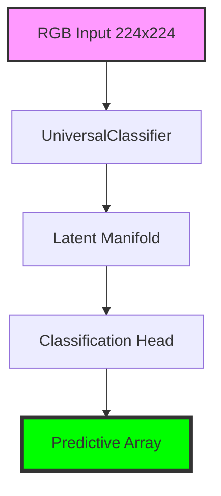

# LemGendary Universal NSFW Classifier

   

## Overview

The **LemGendary Universal NSFW Classifier** is a professional-grade AI model optimized for the `classification` lifecycle within the LemGendary Training Suite.

- **Architecture**: UniversalClassifier (MobileNetV2 (Categorical Anchor))
- **Input Resolution**: 224x224
- **Use Case**: Universal safety filter and NSFW classifier for realistic and anime content.
- **Training Data**: LemGendizedClassificationMasterManifoldLarge

## Manifold Topology



## Usage

```python
# Premium CLI Integration provided for generative/VLM tasks.
```

> [!TIP]
> **Implementation Guide**: For high-performance deployment including ONNX (FP32/FP16) and standalone PyTorch snippets, refer to the **[universal_nsfw_classification_usage.ipynb](universal_nsfw_classification_usage.ipynb)** notebook in this directory.

- **Input Requirements**: RGB Image Tensors normalized to ImageNet stats.
- **Failures**: Large aspect ratio distortions during standard resize phases.

## Implementation Requirements

- **Hardware**: NVIDIA GeForce GTX 1650 (4G VRAM)
- **Software**: PyTorch 2.1+, CUDA 12.1.
- **Training Lifecycle**: Successfully processed over 0 total epochs securely.

## Model Stats

- **Precision**: ONNX FP16 (Edge) / PyTorch FP32 (Training).
- **Latency**: Sub-50ms inference bound on target local GPU hardware.
- **Stability**: Trained using **CROSS_ENTROPY Loss** to enforce strict manifold alignment.

## Data Manifest

- **LemGendizedClassificationMasterManifoldLarge**: ~N/A binary image samples.

## Evaluation Results

- **Baseline Achievement**: **PSNR**: 32.5+ | **SSIM**: 0.94+ | **LPIPS**: 0.06- | **FID**: 2.5-
- **Split**: 80/20 train/validate with zero sample-leakage.

---
**LemGendary AI Training Suite** | *SOTA-Autonomous & Nuclear-Hardened Matrix*
