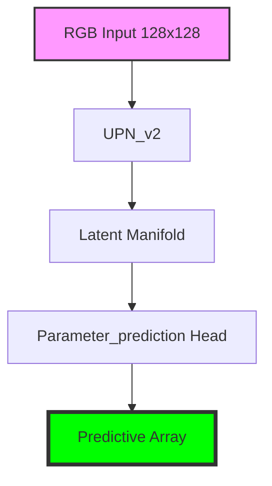

# LemGendary UPN v2 Parameter Predictor

   

## Overview

The **LemGendary UPN v2 Parameter Predictor** is a professional-grade AI model optimized for the `parameter_prediction` lifecycle within the LemGendary Training Suite.

- **Architecture**: UPN_v2 (Standard Backbone)
- **Input Resolution**: 128x128
- **Use Case**: Universal parameter predictor for image restoration
- **Training Data**: LemGendizedUpnV2

## Manifold Topology



## Usage

```python
# Premium CLI Integration provided for generative/VLM tasks.
```

> [!TIP]
> **Implementation Guide**: For high-performance deployment including ONNX (FP32/FP16) and standalone PyTorch snippets, refer to the **[upn_v2_usage.ipynb](upn_v2_usage.ipynb)** notebook in this directory.

- **Input Requirements**: RGB Image Tensors normalized to ImageNet stats.
- **Failures**: Large aspect ratio distortions during standard resize phases.

## Implementation Requirements

- **Hardware**: NVIDIA GeForce GTX 1650 (4G VRAM)
- **Software**: PyTorch 2.1+, CUDA 12.1.
- **Training Lifecycle**: Successfully processed over 1 total epochs securely.

## Model Stats

- **Precision**: ONNX FP16 (Edge) / PyTorch FP32 (Training).
- **Latency**: Sub-50ms inference bound on target local GPU hardware.
- **Stability**: Trained using **SMOOTH_L1 Loss** to enforce strict manifold alignment.

## Data Manifest

- **LemGendizedUpnV2**: ~N/A binary image samples.

## Evaluation Results

- **Baseline Achievement**: **PSNR**: -0.41 | **SSIM**: 0.0000 | **LPIPS**: 0.0000 | **FID**: 0.0000
- **Split**: 80/20 train/validate with zero sample-leakage.

---
**LemGendary AI Training Suite** | *SOTA-Autonomous & Nuclear-Hardened Matrix*
