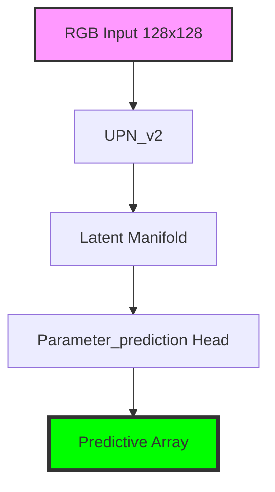

# LemGendary UPN v2 Parameter Predictor

   

## Overview

The **LemGendary UPN v2 Parameter Predictor** is a professional-grade AI model optimized for the `parameter_prediction` lifecycle within the LemGendary Training Suite.

- **Architecture**: UPN_v2 (UPN_v2 (MobileNet-Lite Parameter Regressor))
- **Input Resolution**: 128x128
- **Use Case**: Universal parameter predictor for image restoration
- **Training Data**: LemGendizedUpnV2, LemGendizedUpnV2

## Manifold Topology


```mermaid
graph TD
    Input[RGB Input 128x128] --> Backbone[UPN_v2]
    Backbone --> Manifold[Latent Manifold]
    Manifold --> Head[Parameter_prediction Head]
    Head --> Output[Predictive Array]
    
    style Input fill:#f9f,stroke:#333,stroke-width:2px
    style Output fill:#00ff00,stroke:#333,stroke-width:4px
```

## Usage

```python
# Premium CLI Integration provided for generative/VLM tasks.
```

> [!TIP]
> **Implementation Guide**: For high-performance deployment including ONNX (FP32/FP16) and standalone PyTorch snippets, refer to the **[upn_v2_usage.ipynb](upn_v2_usage.ipynb)** notebook in this directory.

- **Input Requirements**: RGB Image Tensors normalized to ImageNet stats.
- **Failures**: Large aspect ratio distortions during standard resize phases.

## Implementation Requirements

- **Hardware**: NVIDIA GeForce GTX 1650 (4G VRAM)
- **Software**: PyTorch 2.1+, CUDA 12.1.
- **Training Lifecycle**: Successfully processed over 2 total epochs securely.

## Model Stats

- **Precision**: ONNX FP16 (Edge) / PyTorch FP32 (Training).
- **Latency**: Sub-50ms inference bound on target local GPU hardware.
- **Stability**: Trained using **SMOOTH_L1 Loss** to enforce strict manifold alignment.

## Data Manifest

- **LemGendizedUpnV2**: ~N/A binary image samples.
- **LemGendizedUpnV2**: ~N/A binary image samples.

## Evaluation Results

- **Baseline Achievement**: **MAE**: 0.050 | **MSE**: 0.004
- **Split**: 80/20 train/validate with zero sample-leakage.

## Scientific Research & Reference Paper

- **Title**: Deep Photo Enhancer: Unpaired Learning for Image Enhancement from Photographs with GANs
- **Authors**: Yu-Sheng Chen, Yu-Ching Wang, Man-Hsin Kao, Yung-Yu Chuang
- **Publication**: IEEE/CVF Conference on Computer Vision and Pattern Recognition (CVPR) (2018)
- **Canonical Source / Link**: [https://arxiv.org/abs/1712.01021](https://arxiv.org/abs/1712.01021)

```bibtex
@inproceedings{chen2018deep,
  title={Deep photo enhancer: Unpaired learning for image enhancement from photographs with gans},
  author={Chen, Yu-Sheng and Wang, Yu-Ching and Kao, Man-Hsin and Chuang, Yung-Yu},
  booktitle={CVPR},
  pages={6306--6314},
  year={2018}
}
```

---
**LemGendary AI Training Suite** | *SOTA-Autonomous & Nuclear-Hardened Matrix*
