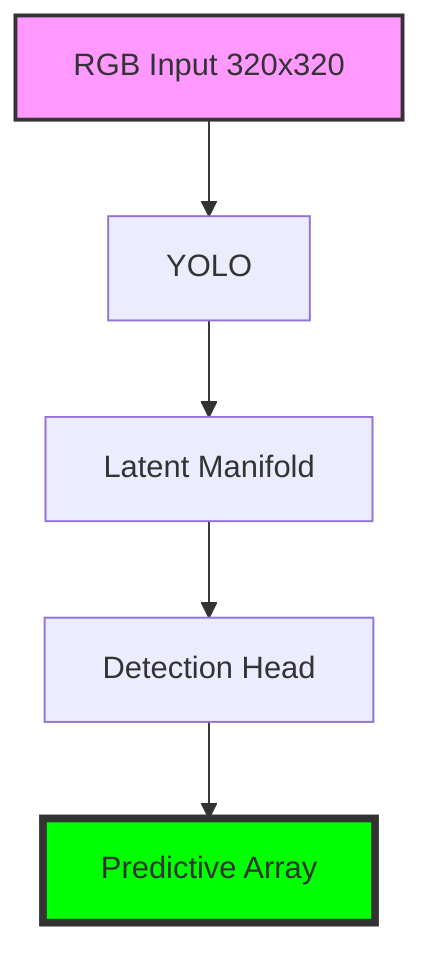

# LemGendary YOLOv8n Multi-Task Model

   

## Overview

The **LemGendary YOLOv8n Multi-Task Model** is a professional-grade AI model optimized for the `detection` lifecycle within the LemGendary Training Suite.

- **Architecture**: YOLO (YOLOv8n (CSPDarknet53 + PANet))
- **Input Resolution**: 320x320
- **Use Case**: Unified YOLOv8n for classification, detection, and pose
- **Training Data**: LemGendizedYoloV8n

## Manifold Topology



## Usage

```python
# Premium CLI Integration provided for generative/VLM tasks.
```

> [!TIP]
> **Implementation Guide**: For high-performance deployment including ONNX (FP32/FP16) and standalone PyTorch snippets, refer to the **[yolov8n_usage.ipynb](yolov8n_usage.ipynb)** notebook in this directory.

- **Input Requirements**: RGB Image Tensors normalized to ImageNet stats.
- **Failures**: Small bounding box occlusion and extreme aspect ratio distortions.

## Implementation Requirements

- **Hardware**: NVIDIA GeForce GTX 1650 (4G VRAM)
- **Software**: PyTorch 2.1+, CUDA 12.1.
- **Training Lifecycle**: Successfully processed over 9 total epochs securely.

## Model Stats

- **Precision**: ONNX FP16 (Edge) / PyTorch FP32 (Training).
- **Latency**: Sub-50ms inference bound on target local GPU hardware.
- **Stability**: Trained using **YOLO Loss** to enforce strict manifold alignment.

## Data Manifest

- **LemGendizedYoloV8n**: ~N/A binary image samples.

## Evaluation Results

- **Target Detection SOTA**: **mAP50**: 0.3122 | **mAP50-95**: 0.2064 | **Box Loss**: 1.20- | **Cls Loss**: 0.50-
- **Validation Protocol**: 80/20 train/validate with zero ground-truth label leakage.

## Scientific Research & Reference Paper

- **Title**: Ultralytics YOLOv8: Real-Time Object Detection, Instance Segmentation, and Pose Estimation
- **Authors**: Glenn Jocher, Ayush Chaurasia, Jing Qiu
- **Publication**: Ultralytics Research (2023)
- **Canonical Source / Link**: [https://github.com/ultralytics/ultralytics](https://github.com/ultralytics/ultralytics)

```bibtex
@software{yolov8_ultralytics,
  author = {Jocher, Glenn and Chaurasia, Ayush and Qiu, Jing},
  title = {Ultralytics YOLOv8},
  version = {8.0.0},
  year = {2023},
  url = {https://github.com/ultralytics/ultralytics}
}
```

---
**LemGendary AI Training Suite** | *SOTA-Autonomous & Nuclear-Hardened Matrix*
